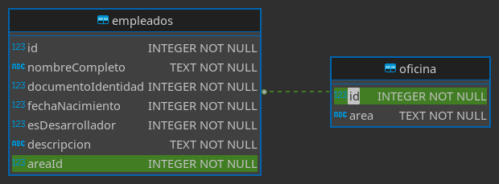

# Base de datos

## Elección de base de datos

Se ha elegido el tipo de base de datos sqlite3 por su sencillez para proyectos pequeños como este. Para proyectos donde se requiere por lo general mucho almacenamiento escogería MariaDB.

## Diagrama Entidad Relación

Se ha creado dos tablas según lo requerido, una para los empleados y la segunda tabla para el área del sector que pertenece el empleado. En ambos casos las columnas id son **Primary key**, la columna **esDesarrollador** es de tipo entero debido a que sqlite3 soporta booleanos a través de valores enteros. En la tabla empleados la columna **areaId** es una **Foreign key** relacionada con el **id** de la tabla oficina.



## Consultas SQL

### Creación de la base de datos

```SQL
CREATE TABLE "empleados" (
	"id"	INTEGER NOT NULL UNIQUE,
	"nombreCompleto"	TEXT NOT NULL,
    "documentoIdentidad" INTEGER NOT NULL UNIQUE,
	"fechaNacimiento"	INTEGER NOT NULL,
	"esDesarrollador"	INTEGER NOT NULL,
	"descripcion"	TEXT NOT NULL,
	"areaId"	INTEGER NOT NULL,
	FOREIGN KEY("areaId") REFERENCES "oficina"("id"),
	PRIMARY KEY("id" AUTOINCREMENT)
);
```

```SQL
CREATE TABLE "oficina" (
	"id"	INTEGER NOT NULL UNIQUE,
	"area"	TEXT NOT NULL,
	PRIMARY KEY("id" AUTOINCREMENT)
);
```

### Obtener datos de los empleados de la base de datos

La siguiente instrucción obtiene todos los empleados y el área a la cual pertenece.

```SQL
SELECT
    empleados.id, empleados.nombreCompleto, empleados.documentoIdentidad,
    empleados.fechaNacimiento, empleados.esDesarrollador,
    empleados.descripcion, oficina.areaFROM empleados
    INNER JOIN oficina WHERE empleados.areaId = oficina.id
```

La siguiente instrucción obtiene todos los empleados y el área a la cual pertenece filtrando por su nombre.

```SQL
SELECT
    empleados.id, empleados.nombreCompleto, empleados.documentoIdentidad,
    empleados.fechaNacimiento, empleados.esDesarrollador,
    empleados.descripcion, oficina.area
    FROM empleados INNER JOIN oficina
    WHERE empleados.nombreCompleto like '%Nombre a buscar%'
    AND empleados.areaId = oficina.id
```

### Modificar de los empleados la base de datos

La siguiente instrucción de ejemplo agrega un empleado a la base de datos.

```SQL
INSERT INTO "empleados"
    ("nombreCompleto", "documentoIdentidad", "fechaNacimiento",
    "esDesarrollador", "descripcion", "areaId")
    VALUES ('Agustín dos Santos', 123456789, 19920714,
    'TRUE', 'Desarrollador frontend', 1);
```

La siguiente instrucción de ejemplo modifica un empleado mediante su número de identificación de la base de datos.

```SQL
UPDATE "empleados" SET
      "nombreCompleto" = "Federico dos Santos",
      "documentoIdentidad" = '987654321',
      "fechaNacimiento" = '19960906',
      "esDesarrollador" = 'FALSE',
      "descripcion" = "DataEntry",
      "areaId" = '1'
      WHERE empleados.id = 1
```

La siguiente instrucción de ejemplo elimina un empleado mediante su número de identificación de la base de datos.

```SQL
DELETE FROM "empleados" WHERE id = 1;
```

### Área de empleados

La siguiente instrucción de ejemplo obtiene la identifiación y el nombre todas las áreas disponible de la base de datos.

```SQL
SELECT * FROM "oficina"
```

La siguiente instrucción de ejemplo añade un área a la tabla oficina de la base de datos.

```SQL
INSERT INTO oficina("area") VALUES ('SS. Gestión de la movilidad')
```
